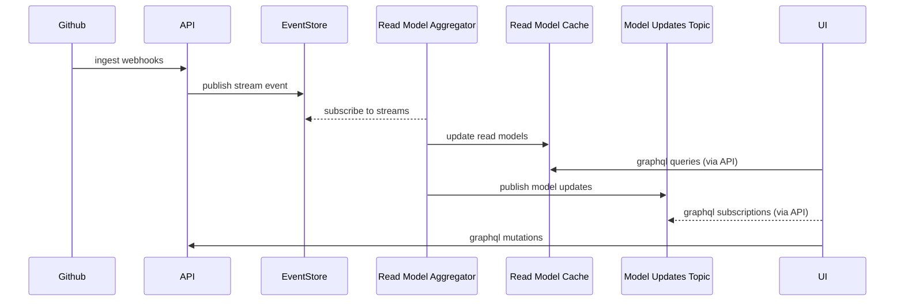

# Event Sourcing Notes

https://andycmaj.notion.site/Event-Sourcing-Notes-d8b7c0eef12240b295e163930a759b76

# Architecture of this Demo

## Data flow

```mermaid
sequenceDiagram
    participant Github
    participant API
    participant EventStore
    participant Read Model Aggregator
    participant Read Model Cache
    participant Model Updates Topic
    participant UI
    
    Github->>API:ingest webhooks
    API->>EventStore:publish stream event
    Read Model Aggregator-->>EventStore:subscribe to streams
    Read Model Aggregator->>Read Model Cache:update read models
    UI->>Read Model Cache:graphql queries (via API)
    Read Model Aggregator->>Model Updates Topic:publish model updates
    UI-->>Model Updates Topic:graphql subscriptions (via API)
    UI->>API:graphql mutations
```

